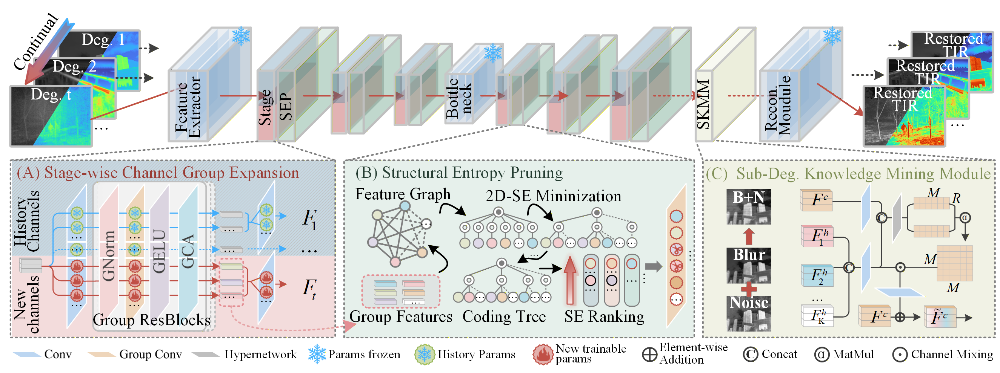

# Expandable, Compressible, Mineable: Open-World Thermal Image Restoration (ECMRNet) [ICML 2026]
### Pu Li, Huafeng Li*, Yafei Zhang, Wen Wang, Neng Dong, Jie Wen
---



---

### Dataset Download
The datasets (HM-TIR[1], M3FD[2], EN[3], TIR100[4], and AWMM[5]) are provided in [Google Drive](https://drive.google.com/file/d/1Tp0GML1VSiG5L9D47x4-uDnBb0zgdygx/view?usp=drive_link).

### Data Peprocessing
Before training or evaluation, please first split the HM-TIR dataset and apply the same degradation pipeline to both HM-TIR and M3FD images by running:
```
python ./codes/utils/Tir_Degradation.py
```

### Training
1. Before training, please first divide the HM-TIR training set into patches to generate training samples by running:
```
python ./codes/utils/Tir_patches.py
```
2. For clean-to-clean self-reconstruction pretraining, please run:
```
python ./codes/train/AE_pretrained.py
```
3. The model is trained on three single degradations, including low contrast, blur, and noise, as well as their composed degradations. To train the model, please run:
```
python ./codes/train/train.py
```

### Evaluation
The evaluation covers synthetic degradation sequences on HM-TIR and M3FD, as well as three real-world degraded datasets. You can either test using your own trained checkpoints or load our pretrained weights from ```./ckpts/ECMRNet.pth```, and then run:
```
python ./codes/infer.py
```

### Any Question

If you have any other questions about the code, please email to lip@stu.kust.edu.cn or lipu2024626@gmail.com.

## References
[1] Liu, Jinyuan, et al. "Enhancing infrared vision: progressive prompt fusion network and benchmark." Advances in Neural Information Processing Systems 38 (2026): 96850-96875.

[2] Liu, Jinyuan, et al. "Target-aware dual adversarial learning and a multi-scenario multi-modality benchmark to fuse infrared and visible for object detection." Proceedings of the IEEE/CVF conference on computer vision and pattern recognition. 2022.

[3] Kuang, Xiaodong, et al. "Single infrared image enhancement using a deep convolutional neural network." Neurocomputing 332 (2019): 119-128.

[4] He, Zewei, et al. "Single-image-based nonuniformity correction of uncooled long-wave infrared detectors: A deep-learning approach." Applied optics 57.18 (2018): D155-D164.

[5] Li, Xilai, et al. "All-weather multi-modality image fusion: Unified framework and 100k benchmark." Information Fusion (2026): 104130.
